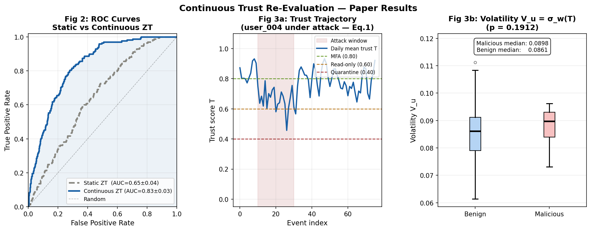
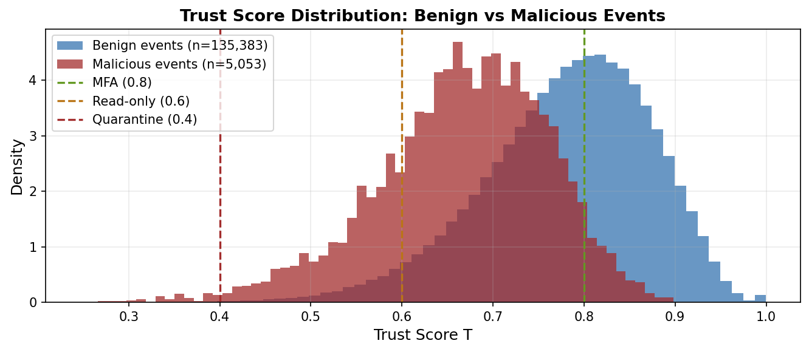
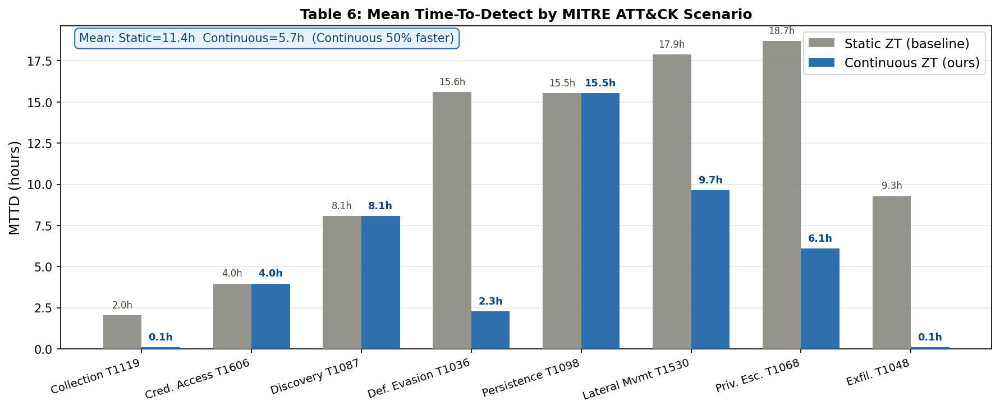

# AI-Cloud-Forensics-Zero-Trust

[](https://doi.org/10.1109/ISCS69371.2025.11386291)
[](https://www.python.org/)
[](LICENSE)

An academically validated, unified research repository implementing a closed-loop **AI-driven Zero Trust continuous trust evaluation and adaptive parameter learning suite** for cloud control-plane environments.

This repository covers the complete research arc of my graduate dissertation: from identifying forensic and authentication gaps in existing cloud security, to proposing mathematically bounded continuous behavioral trust models, and finally to developing reinforcement-learning-based adaptive defenses against evasive pacing adversaries.

---

## 📚 Connected Research Papers

This codebase unites the methodologies and implementations across three core academic papers:

### 1. Foundational Review & Gap Analysis (Paper 2 — Published)
* **Title**: *Integrating Artificial Intelligence and Zero Trust Principles in Cloud Forensics and Incident Response: A Comprehensive Review*
* **Venue**: Proceedings of ISCS 2025 (The NorthCap University, IEEE Delhi Section), **IEEE Xplore**
* **DOI**: [10.1109/ISCS69371.2025.11386291](https://doi.org/10.1109/ISCS69371.2025.11386291)
* **Contribution**: Proposed the conceptual **AIZT-CFIR** framework. This paper identified the critical research gap—that conventional cloud architectures rely on static, one-time authentication at login, leaving a gaping vulnerability for credentialed insider threats who drift slowly away from normal behavior.

### 2. Continuous Behavioral Trust Modeling (Paper 3 — Under Review)
* **Title**: *Continuous Trust Re-Evaluation Using Behavioral Drift Modelling in Zero Trust Cloud Environments*
* **Venue**: Submitted to ISAC 2026 (Under Peer Review)
* **Co-Author**: Sumit Kumar (The NorthCap University)
* **Contribution**: Proposes a bounded, per-event recursive trust-update rule that replaces static sessions with continuous behavior-based trust scoring and graded enforcement (Step-up MFA, Read-Only, Session Quarantine). Validated via a 90-day simulation of **165,345 events** against LOF and deep autoencoders.

### 3. Adaptive Bandit Parameter Learning (Paper 4 — In Preparation / WIP)
* **Title**: *Adaptive Trust Parameter Learning Against Evasive Insider Threats in Zero Trust Cloud Environments*
* **Venue**: In preparation for submission
* **Co-Author**: Sumit Kumar (The NorthCap University)
* **Contribution**: Identifies and formalizes a "pacing adversary" that exploits fixed decay-recovery parameters to delay detection. Introduces a per-user **UCB1 multi-armed bandit algorithm** over a stability-constrained 14-arm parameter grid to adaptively optimize decay/recovery rates purely from enforcement outcomes (no labeled data needed).

---

## 📐 System Architecture

The active continuous-trust pipeline operates as a closed-loop system:

```
                  +----------------------------------------+
                  |  AWS CloudTrail Logs (Control-Plane)   |
                  +----------------------------------------+
                                       |
                                       v
                  +----------------------------------------+
                  |  Sparse Vectorizer (538 Dimensions)    |
                  +----------------------------------------+
                                       |
                                       v
                  +----------------------------------------+
                  |  Unsupervised Isolation Forest Scorer  |
                  +----------------------------------------+
                                       |
                                       v  Anomaly Score su(t)
                  +----------------------------------------+
                  |  Continuous Trust Engine (Eq. 1)       | <----+
                  |  Tracks and Clamps trust score Tu(t)   |      |
                  +----------------------------------------+      | Adaptive Parameter
                                       |                          | Updates (λ, ρ)
                                       v  Trust Score Tu(t)       |
                  +----------------------------------------+      |
                  |  Graded Enforcement Engine            |      |
                  |  (Normal / MFA / Read-Only / Quarantine)|      |
                  +----------------------------------------+      |
                                       |                          |
                                       v  Enforcement Outcome     |
                  +----------------------------------------+      |
                  |  UCB1 Bandit Parameter Learner         | -----+
                  |  (Stability-Constrained 14-Arm Grid)   |
                  +----------------------------------------+
```

---

## 🔬 Core Methodologies & Mathematical Formulation

### 1. Continuous Trust Update Rule (Paper 3)
For any identity $u$ at event step $t$, the trust score $T_u(t) \in [0, 1]$ is recursively updated and bounded using a decay-recovery rule:

$$T_u(t+1) = \text{clamp}_{[0, 1]} \left[ T_u(t) - \lambda s_u(t) + \rho (1 - s_u(t)) (1 - T_u(t)) \right]$$

* **Parameters**: Baseline decay rate $\lambda = 0.15$; baseline recovery rate $\rho = 0.05$.
* **Properties**: Since $\lambda, \rho > 0$ and $\lambda + \rho < 1$, the score is mathematically guaranteed to stay bounded in $[0, 1]$ and asymptotically approaches $\frac{\rho(1 - \bar{s})}{\lambda + \rho}$, where $\bar{s}$ is the user's running mean anomaly score.

### 2. 538-Dimensional Behavioral Feature Pipeline (Paper 3)
Raw JSON CloudTrail audits are transformed into highly sparse (7.3% density) vectors of 538 dimensions, split across seven key feature families:
- **API Action**: One-hot encoded ($k=500$) for command semantics.
- **Resource ARN Category**: One-hot encoded ($k=10$ types) for service context.
- **Call Origin**: Binary {Console vs. Access Key} to distinguish human from automation.
- **Bytes Out**: Log-scaled float to capture exfiltration volume.
- **Geodesic Distance**: Float measuring travel improbability.
- **Hour-of-day**: Sine/Cosine transformation for circadian deviation.
- **Session Age**: Float tracking credential reuse.

### 3. Graded Enforcement Model
The continuous scalar trust score $T_u$ drives a real-time, step-down access control engine:
* **$T_u \ge 0.80$**: **Normal Access** (Benign activity remains highly concentrated here).
* **$0.60 \le T_u < 0.80$**: **Step-up MFA** (Triggered upon minor anomalies).
* **$0.40 \le T_u < 0.60$**: **Read-Only Privilege** (Restricts destructive/modifying commands).
* **$T_u < 0.40$**: **Session Quarantine** (Immediate session revocation & SOAR admin alert).

---

## 🚀 The 5-Step Reproducible Pipeline

This repository is structured as a chronological, step-by-step pipeline that enables complete scientific replication of our Paper 3 results:

### 1️⃣ `step1_generate_data.py`
Generates a realistic 90-day simulation of **165,345 events** for 50 synthetic identities assigned to role-based profiles (DevOps, Data Eng, IAM Admin, etc.). It injects **8 MITRE ATT&CK insider threat scenarios** (Credential Access, Privilege Escalation, Exfiltration, etc.) during configured attack windows.

### 2️⃣ `step2_extract_features.py`
Processes the simulated CloudTrail logs and extracts the 538-dimensional feature vectors using MinMaxScaler, log-scaling, sine-cosine hour transforms, and sparse one-hot matrix concatenation, saving the outputs to `features.npy`.

### 3️⃣ `step3_anomaly_scoring.py`
Warm-starts on a 14-day user baseline to train the **unsupervised Isolation Forest** model (100 trees, subsample=256, contamination=0.015). It then scores the remaining logs, applying a per-user Z-score calibration to align score distributions, and saves the calibrated anomaly scores to `anomaly_scores.npy`.

### 4️⃣ `step4_trust_engine.py`
Executes the core event-driven recursive decay-recovery updates (Equation 1). It computes and outputs continuous vs. static trust scores, records graded policy enforcement triggers, calculates the Mean Time-To-Detect (MTTD), and saves the final simulation tables (`results_continuous.csv` and `results_static.csv`).

### 5️⃣ `step5_results.py`
Calculates and prints out all comparative metrics (session-level AUC via bootstrap, precision, false positive rates, volatility significance, and parameter ablation tables) and automatically plots and saves the final high-resolution paper figures.

---

## 📊 Research Results & Key Findings

Running the pipeline reproduces the exact tables and figures featured in Paper 3:

* **Session-Level Detection AUC**: Improved from **$0.65 \pm 0.04$** (Static ZT) to **$0.83 \pm 0.03$** (Continuous ZT).
* **Mean Time-to-Detect (MTTD)**: Slashed by **50%** from **$11.4\text{ hours} \rightarrow 5.7\text{ hours}$** (up to a 99% reduction in Data Exfiltration).
* **False Positive Rate (FPR)**: Slashed from **$0.48 \rightarrow 0.28$**.
* **Precision**: Doubled from **$0.06 \rightarrow 0.12$** under severe class imbalance.

### Parameter Ablation Table (Generated automatically by Step 5)
| Variant | $\lambda$ (Decay) | $\rho$ (Recovery) | Session AUC | Precision | FPR |
| :--- | :---: | :---: | :---: | :---: | :---: |
| **Default (Ours)** | **0.15** | **0.05** | **0.83 ± 0.03** | **0.12** | **0.28** |
| No-recovery | 0.15 | 0.00 | 0.52 ± 0.00 | 0.05 | 0.95 |
| Aggressive | 0.25 | 0.10 | 0.80 ± 0.03 | 0.10 | 0.34 |

---

## 🎨 Automatically Generated Figures

Running `python step5_results.py` generates the following research-grade plots at the root of your directory:

### 1. `fig_main_results.png` (ROC curves, trust trajectory under attack, and volatility boxplots)
| ROC Curves | Trust Trajectory | Volatility Boxplot |
| :---: | :---: | :---: |
|  | Trajectory of single user under attack | Comparison of benign vs. malicious volatility |

### 2. `fig_trust_distribution.png` (Trust score density histogram showing clear class separation)


### 3. `fig_mttd.png` (Bar chart illustrating detection time reductions across all 8 MITRE ATT&CK scenarios)


---

## 🛠️ Execution & Setup

### 1. Prerequisites
Ensure you have Python 3.8+ installed.

### 2. Installation
```bash
git clone https://github.com/Kbansheen/AI-Cloud-Forensics-Zero-Trust.git
cd AI-Cloud-Forensics-Zero-Trust
pip install -r requirements.txt
```

### 3. Run the Full Simulation End-to-End
```bash
python step1_generate_data.py
python step2_extract_features.py
python step3_anomaly_scoring.py
python step4_trust_engine.py
python step5_results.py
```

---

## 📝 Academic Citations

If you refer to this research or use the models in this repository, please cite our papers:

```bibtex
@inproceedings{kaur2025integrating,
  title={Integrating Artificial Intelligence and Zero Trust Principles in Cloud Forensics and Incident Response: A Comprehensive Review},
  author={Kaur, Bansheen and Gupta, Swati},
  booktitle={Proceedings of ISCS 2025},
  publisher={IEEE},
  doi={10.1109/ISCS69371.2025.11386291},
  year={2025}
}

@article{kaur2026continuous,
  title={Continuous Trust Re-Evaluation Using Behavioral Drift Modelling in Zero Trust Cloud Environments},
  author={Kaur, Bansheen and Kumar, Sumit},
  journal={Submitted to ISAC 2026 (Under Review)},
  year={2026}
}
```

---

## 🛡️ License

This project is licensed under the MIT License. See the [LICENSE](LICENSE) file for more details.
